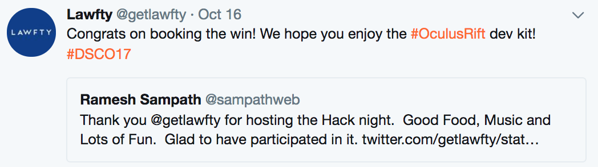

## Data Institute NFL Hack Night Competiton

* Competition: https://www.kaggle.com/c/predict-nfl-game-scores-lawfty-dsco17/leaderboard

Code for Data Hack Night at Data Institute SF 2017 (http://www.sfdatainstitute.org/conference.html).  

Won First Place with the simple Random Forest Model.  Tried few different models with XGBoost, Logistic Regression and even Neural Nets, but couldn't beat the Random Forest for this dataset.  Didn't do much feature engineering other than binarizing the week of the NFL game.  So, I am sure there's tons of room for improvement. :-)

